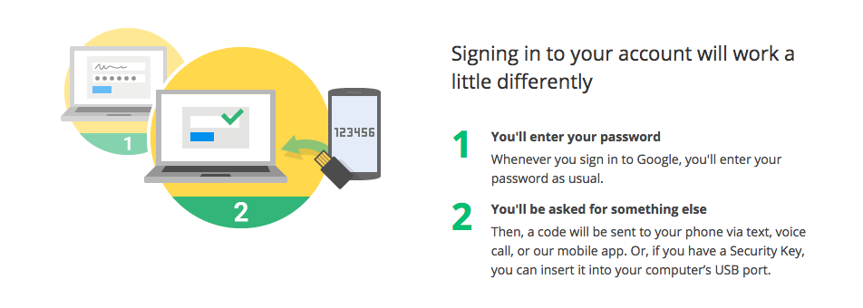
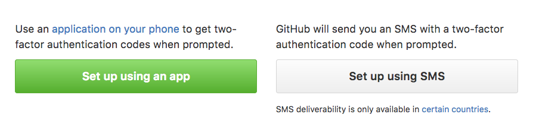
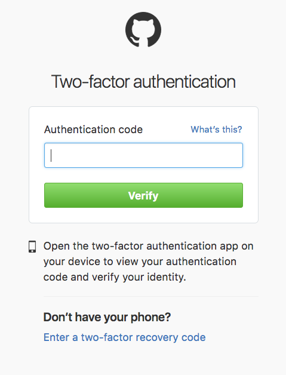

# What is two-factor authentication?

### What is two-factor authentication?

- Also known as 2FA and TFA

- It is a type of 'multi factor authentication' that requires not only a password and username but
also something that only, and only, that user has on them. An example of this would be google's 2FA process
for user login where they send you a code via SMS.

This google user authentication is a great example of a **Time-based One-time Password Algorithm** (TOTP).
The Time-based One-time Password Algorithm is an algorithm that computes a one-time password from a shared secret key and the current time.

#### Two-factor authentication on GitHub

GitHub supports two-stage authentication to login to your account.

1. Set up two-stage authentication in the security section of your GitHub settings.

2. There are two options, via SMS an app.

3. Download an authentication app. Interestingly the apps are all third party apps and not provided by GitHub.

4. Once set up, every time you open the application it provides you with a authentication code (TOTP).

5. After you insert your username and password you will be asked for the authentication code.

6. You are now logged in! 

All the of steps to set up two-stage authentication can be found [here](https://help.github.com/articles/configuring-two-factor-authentication-via-a-totp-mobile-app/ "GitHub 2FA setup step-by-step")

Finally - with node modules like [speakeasy](https://github.com/speakeasyjs/speakeasy) you can use two-stage authentication on your
projects with Google Authenticator!

# What are the benefits of oAuth?
# How do you write tests for an Authenticated endpoint?
# How and why should you hash user passwords and sensitive information? (Bcrypt example)
