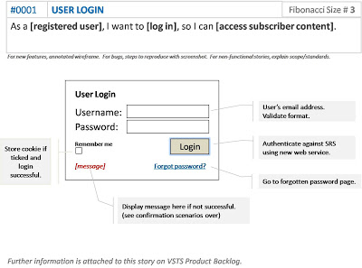
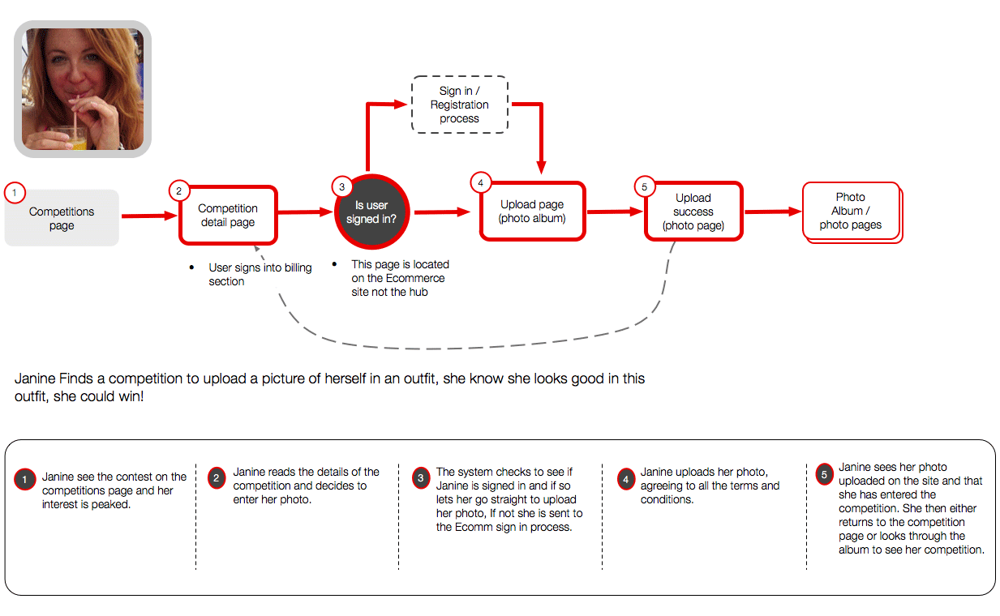

# What is the difference between a Journey and a Story?

## User Story

This is a short, simple description of a feature told from the perspective of the person who desires the new capability, usually a user or customer of the system.
User stories work well for the product **functionality**.

It typically follows a simple template:

```
“**As a** ‘type of user’,
 **I want** ‘some goal’
 **so that** ‘some reason’.”
```


## User Journey

A user journey is a series of steps (typically 4-12) which represent a scenario in which a user might interact with the thing you are designing. They can be used for 2 main things:

* Demonstrating the way users **currently** interact with the service / website / product
* Demonstrating the way users **could** interact with the service / website / product



## How a User Story is Different from a User Journey

This does depend on the context of its usage but a User Story is based on a specific user, so this could cater for a particular type of user to answer a specific problem whereas a User Journey can be a random user that may use the web app.

**Note: Based on context, a User Journey and Story can be one and the same.**

## References
1. [10 tips for writing good user stories](http://www.romanpichler.com/blog/10-tips-writing-good-user-stories/)
2.  [User Stories – The Beginner's Guide](http://theuxreview.co.uk/user-stories-the-beginners-guide/)
3. [User Journeys Beginner's Guide](http://theuxreview.co.uk/user-journeys-beginners-guide/)
4. [UX The Difference between User Journey and User Story](http://www.i3lance.co.uk/2015/02/the-difference-between-storyboard-and-user-journey-and-user-story/)

# What is 'the Job To be Done'?
