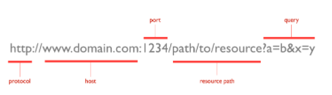

# Same-origin Policy

## What is an origin?

The origin of a webpage is made up of a protocol, a host, and a port.

The Same-origin Policy calls for host, protocol and port to match.

## Same-origin Policy
- Is built into modern browsers
- Provides a barrier between pages and scripts hosted on different domains
- Permits unrestricted interactions between pages served as part of the same site

## What if there was no Same-origin Policy
- Malicious javascript programs could use cookies to access your session data and
  - Access your bank accounts
  - Make transactions on your behalf
  - Gain control of your site access and passwords
  - And so on
- You would have to limit yourself to one-at-a-time, single-threaded, synchronous website sessions to prevent unauthorised interactions between sites

## What is allowed under the same-origin policy?
- Cross-origin writes
  - links
  - redirects
  - form submissions
- Cross-origin embedding
  - Embed scripts, images, CSS etc from other sites

## Lolipop Questions
- Why do we have the Same-origin policy?
- What's an origin?
- What's allowed under the same origin policy?
