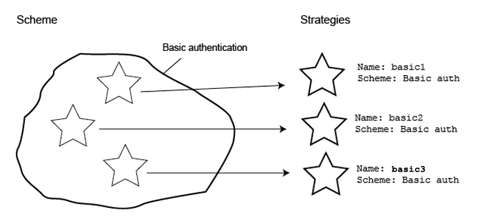

## What are some of the different ways Hapi implements authentication?


SCHEMES

A scheme is a general type of authentication like ```basic``` and ```digest```. You can think of a scheme as a template for authentication. A scheme isn’t used directly to authenticate users, instead you create a specific strategy from the scheme.

STRATEGIES

A strategy is a configured instance of a scheme with an assigned name. Strategies exist so you can use the same scheme several times, in a slightly different way. For instance, might decide to you want use basic authentication in your app. For some routes you might wish to validate a user’s passwords against a value in a database and for some other routes, you might wish to check the password against a value stored in a text file. In this case you can create 2 different strategies from the scheme. The scheme to strategy relationship is described visually below:



### One-way encryption of user passwords with Bcrypt


 We have to make sure that the password is always encrypted before being saved.

>In cryptography, a salt is random data that is used as an additional input to a one-way function that "hashes" a password or passphrase.  The primary function of salts is to defend against dictionary attacks or against its hashed equivalent, a pre-computed rainbow table attack.
>
>A new salt is randomly generated for each password.
>
> In a typical setting, the salt and the password (or its version after Key stretching) are concatenated and processed with a cryptographic hash function, and the resulting output (but not the original password) is stored with the salt in a database. Hashing allows for later authentication without keeping and therefore risking the plaintext password in the event that the authentication data store is compromised.

>Since salts do not have to be memorized by humans they can make the size of the rainbow table required for a successful attack prohibitively large without placing a burden on the users. Since salts are different in each case, they also protect commonly used passwords, or those who use the same password on several sites, by making all salted hash instances for the same password different from each other.

> From Wikipedia

genSalt(rounds, callback)
- rounds - [OPTIONAL] - the number of rounds to process the data for. (default - 10)
- callback - [REQUIRED] - a callback to be fired once the salt has been generated.
  - error - First parameter to the callback detailing any errors.
  - result - Second parameter to the callback providing the generated salt.

hash(data, salt, progress, cb)
- data - [REQUIRED] - the data to be encrypted.
- salt - [REQUIRED] - the salt to be used to hash the password.
- progress - a callback to be called during the hash calculation to signify progress
- callback - [REQUIRED] - a callback to be fired once the data has been encrypted.
  * error - First parameter to the callback detailing any errors.
  * result - Second parameter to the callback providing the encrypted form.

compare(data, encrypted, cb)
- data - [REQUIRED] - data to compare.
- encrypted - [REQUIRED] - data to be compared to.
-  callback - [REQUIRED] - a callback to be fired once the data has been compared.
  - error - First parameter to the callback detailing any errors.
  - result - Second parameter to the callback providing whether the data and encrypted forms match [true | false].

  > Bcrypt.compare(candidate_plain_text_password, hash, callback) compares the candidate password provided in
  > plain text with a given hash. You don’t need to hash your candidate before checking if they match.

```
var Bcrypt = require('bcrypt');
var SALT_WORK_FACTOR = 10;
var pass = '123456789';

Bcrypt.genSalt(SALT_WORK_FACTOR, function(err, salt) {
        if(err) {
                return console.error(err);
        }

        Bcrypt.hash(pass, salt, function(err, hash) {
                if(err) {
                        return console.error(err);
                }

                console.log(hash);

                Bcrypt.compare(pass, hash, function(err, isMatch) {
                        if(err) {
                                return console.error(err);
                        }

                        console.log('do they match?', isMatch);
                });

        });
});
```
## Authentication example

- hapi-auth-basic is plugin (you have to register plugins)

To create an authentication strategy for your hapi server, leverage the server.auth.strategy(name, scheme, options) function that expects three (optionally four) parameters:

- name: your strategy name that will be used throughout your app
- scheme: the scheme name on which the strategy is based upon (e.g. basic)
- options: additional options

validateFunc. That’s a function with the signature function(request, username, password, callback), where

- request: is the hapi request object which requires authentication
- username: username send by the client
- password: password send by the client
- callback: with the signature function(err, isValid, credentials)
  *  err: internal error object that replaces the default Boom.unauthorized if defined
  *  isValid: boolean that indicates if the username was found and passwords match
  * credentials: user’s credentials, only included if isValid is true

```
const hapi = require('hapi');
const server = new hapi.Server();
const BasicAuth = require('hapi-auth-basic');
const Bcrypt = require('bcrypt');

var users = {
  future: {
    id: '1',
    username: 'future',
    password: '$2a$04$YPy8WdAtWswed8b9MfKixebJkVUhEZxQCrExQaxzhcdR2xMmpSJiG'  // 'studio'
  }
}

server.connection({
  host: 'localhost',
  port: 5000
});

server.register(BasicAuth, function(err){
   if (err) throw err;
  var basicValidation = function(request,username,password,callback){
    var user = users[username];
    if (!user) return callback(null,false);
    console.log(user.username,user.password);
    Bcrypt.compare(password,user.password, function(err,isValid){
      callback(err, isValid, { id: user.id, username: user.username });
    });
  };
  server.auth.strategy('simple','basic', {validateFunc:basicValidation})


  server.route({
    method: 'GET',
    path: '/private-route',
    config: {
      auth: 'simple',
      handler: function (request, reply) {
        reply('Yeah! This message is only available for authenticated users!')
      }
    }
  });

  server.start(function(err){
    if (err) throw err;
    console.log(`Server is running at port ${server.info.uri}`);
  });

});

```

## References
- [devsmash](http://devsmash.com/blog/password-authentication-with-mongoose-and-bcrypt)
- [soledadpenades](https://soledadpenades.com/2015/01/03/hashing-passwords-with-bcrypt-and-node-js/)
- [npm-bcrypt](https://www.npmjs.com/package/bcrypt-nodejs)
- [futurestud](https://futurestud.io/tutorials/hapi-basic-authentication-with-username-and-password)
- [dwyl/learn-json-webtokens](https://github.com/dwyl/learn-json-web-tokens)
- [hapi-auth-basic](https://github.com/hapijs/hapi-auth-basic)
