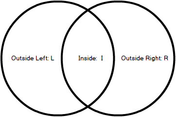

# Choosing tables structure and joining

## Best practices in table structures (e.g. normalization)

## What is a primary key and why is it useful?

Each table within a relational database needs a primary key column. The purpose of a primary key is to make a clear distinction between each entry. This prevents abiguity, as there can be no duplicates. You will have heard of this 'unique identifier' coencept before in everyday life, in the context of an employee number on your payslips, your banking customer reference number, your library number, etc etc. Realistically, your name, address, and any other info about you just isn't unique enough :scream:

Another useful element of primary keys is to speed up specific queries. For example, trying to find a particular user by querying the surname `Smith` would take far longer than looking up their primary key.

The primary key column can be automatically generated by the database, or we can choose a column of the table to perform this function.

E.g. making the product number (`product_no`) the primary key of our `product` table:
```
CREATE TABLE products (
    product_no integer PRIMARY KEY,
    name text,
    price numeric
);
```

One very important property of a primary key is that it can never be `null`! If you think about it, it would be pretty useless as a reference point otherwise e.g. if your customer reference number could be blank. Likewise, once created, a primary key can never be altered so that its value is `null`.

The primary key for each table is stored in an index. You can think of this like the index page in a book. It enforces the uniqueness requirement.


### Choosing a primary key
Think about what a primary key is for - it's supposed to uniquely identify the entry. So good choices might be:
- National Insurance Number
- License Plate Number


The following points are more useful for database design:

### Short keys
The SQL Server query processor uses the primary key for lookups and comparisons. So the briefer the index entries, the faster your queries can be.

### Processing speed
In terms of improving the processing speed, it is worth choosing primary keys with no embedded spaces, special characters, or differentiation between lowercase and uppercase values.

Data types:
1. The integer data type is the best choice of for your primary key
2. Fixed-length character

This difference in efficiency is down to the way that SQL Server deals with characters: by converting them to their ASCII equivalent before processing.

Variable-length character data types are even worse, because SQL Server has to decompress variable-length character data before processing the data. This extra step consumes valuable processing power.

### A value that will never change
A bad example would be to choose your customer's address as their primary key. If the customer moves house, you would have to assign them a new primary key, which would mess with their transaction history.

Another good reason for this never to change is that each time a primary key was changed, the associated foreign key in other tables would each have to be updated too.

So a primary key that never changes may seem like an obvious idea. But sometimes primary keys are created which contain real-world meanings. _It is generally better for primary keys not to be based on intrinsic meaning that is related to the individual e.g. the first 2 digits of your customer reference number correspond to your house number._ One notable exceptions to this is the customer reference number assigned to you by your bank, which sometimes uses the customer's DOB. This is a safer choice, as each person's DOB will never change.


## How do you join separate tables?

## Differences between inner / outer joins

This difference between inner and outer joins is commonly demonstrated using ~~buttocks~~ Venn Diagrams.
Why buck years of tradition?




IMAGINE TWO CIRCLES. THEY ARE PARTIALLY OVERLAPPING. THERE ARE THREE AREAS TO THIS DIAGRAM. THESE ARE THE INSIDE, THE OUTSIDE LEFT, THE OUTSIDE RIGHT. Lets call them I, L, and R.

These two circles are secretly tables, the area within them represents the data that they contain.

Essentially Inner join will make a new table with the shared values of the joined values. It makes a new table which includes the data in I

Outer Join can be used in three different ways.
It can return L + I, R + I, or   L + R + I

http://stackoverflow.com/questions/38549/what-is-the-difference-between-inner-join-and-outer-join


## Give a practical example of a database with at least 2 tables.

This example database shows a possible database used by an online store.


This diagram may be initally confusing as rows in the diagram correspond to columns of data in the actual table. If you imagine this diagram as representation of what information is included in the actual database you should be okay!
